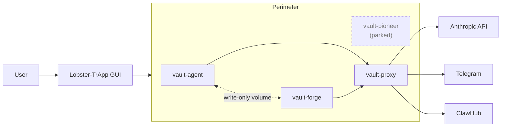

# Lobster-TrApp

[](https://github.com/albertdobmeyer/lobster-trapp/actions/workflows/ci.yml) [](LICENSE)

A desktop application that runs the [OpenClaw](https://www.getopenclaw.ai) Clawbot inside a four-container security perimeter on the user's own computer, with a Telegram interface for chat. Open-source under MIT.

The architecture, threat model, and per-component capabilities are described in [`docs/trifecta.md`](docs/trifecta.md).

**Author:** [@albertdobmeyer](https://github.com/albertdobmeyer) · **Public landing page:** [lobster-trapp.com](https://lobster-trapp.com)

---

## Purpose

OpenClaw is an autonomous AI agent capable of executing shell commands, reading files, and loading skills from a third-party registry. Run with default settings, the agent has the same operating-system privileges as the user. The ClawHavoc study (2026-Q1) classified 11.9 % of published ClawHub skills as malicious (341 of 2,857). Lobster-TrApp wraps the agent in a defense-in-depth perimeter to reduce the impact of agent compromise, malicious skills, and prompt-injection attacks.

The agent's reasoning is performed by [Anthropic](https://www.anthropic.com)'s API; only the agent's execution layer (file work, tool calls, skill invocations) is local.

## Capabilities (default Split Shell)

- Telegram bot interface — message the Clawbot from a paired phone
- File read/write within a sandboxed workspace; the host filesystem is not exposed to the container
- Image processing on Telegram-supplied content
- Skill loading from ClawHub gated by a 87-pattern scanner with MITRE-ATT&CK mapping and Content Disarm & Reconstruction
- 24-point startup verification of the perimeter topology
- API keys held by `vault-proxy` and injected per request; the agent container never reads the literal key

Web browsing, web fetch, and the broader OpenClaw tool surface are not enabled by default. They are available at "Soft Shell" via CLI configuration in v0.3.0; see [`components/openclaw-vault/`](components/openclaw-vault/).

## Limitations

- This is experimental software. It is provided as-is, without warranty of any kind. The authors accept no responsibility for damage resulting from its use.
- Autonomous AI agent containment is an open research problem. The perimeter raises the cost of a successful compromise; it does not eliminate the possibility. The full attacker-capability matrix and residual-risk enumeration are in [`docs/threat-model.md`](docs/threat-model.md); the differential against alternative containment strategies (Firejail, gVisor, VM-only isolation, scanner-only, etc.) is in [`docs/why-not-x.md`](docs/why-not-x.md).
- The agent's reasoning is not local. Operating Lobster-TrApp without internet access to Anthropic's API is not supported.
- Installer binaries are signed with the Tauri auto-updater key, not with OS-level code-signing certificates. macOS Gatekeeper and Windows SmartScreen will display a first-launch warning.
- One of the three originally-planned modules (`moltbook-pioneer`) is **parked since 2026-05-03**. The target API has been intermittent since 2026-04-05 following Meta's acquisition of Moltbook. The container is still defined in `compose.yml`; the code is preserved at [`components/moltbook-pioneer/`](components/moltbook-pioneer/).

## Requirements

- 64-bit Linux, macOS (Apple Silicon or Intel), or Windows
- [Podman](https://podman.io/) or [Docker](https://www.docker.com/) installed and runnable by the current user
- Approximately 4 GB free disk space for the four container images
- An [Anthropic API key](https://console.anthropic.com/) and a Telegram bot token (the in-app setup wizard explains how to obtain both)

## Installation

Pre-built installers for all three platforms are attached to each [GitHub release](https://github.com/albertdobmeyer/lobster-trapp/releases/latest):

| Platform | Format |
|----------|--------|
| Linux    | `.deb`, `.rpm`, `.AppImage` |
| macOS    | `.dmg` (Apple Silicon and Intel) |
| Windows  | `.msi`, `.exe` |

The setup wizard verifies that Podman or Docker is installed and walks the user through API-key entry and Telegram pairing. No terminal interaction is required after install.

For unsupported platforms or to audit the build pipeline, see *Building from source* below.

---

<details>
<summary><strong>Architecture summary</strong></summary>

The runtime perimeter consists of four containers connected by an internal compose network:

| Container | Role | Description |
|-----------|------|-------------|
| `vault-agent`   | Runtime containment | Read-only root filesystem, all Linux capabilities dropped, custom syscall profile, workspace mount only |
| `vault-forge`   | Supply-chain defense | 87-pattern skill scanner, zero-trust line verifier, Content Disarm & Reconstruction pipeline |
| `vault-proxy`   | Egress gateway      | Holds API keys, enforces a domain allowlist, logs every request, the only path to the public internet |
| `vault-pioneer` | Social-content analysis | **Parked** — see *Limitations* |

Each container has its own internal network. `vault-proxy` is the only bridge between them; `vault-agent` cannot reach `vault-forge` or `vault-pioneer` directly.



Five Mermaid drawings (topology, trust tiers, network-isolation matrix, the skill-loading flow, the assistant-state machine) are in [`docs/diagrams.md`](docs/diagrams.md). The full architecture, attacker-capability matrix, defense-in-depth tables, and ownership matrix are in [`docs/trifecta.md`](docs/trifecta.md) and [`docs/threat-model.md`](docs/threat-model.md).

</details>

<details>
<summary><strong>Building from source</strong></summary>

All three submodules are public; no special access is required.

```bash
git clone --recurse-submodules https://github.com/albertdobmeyer/lobster-trapp.git
cd lobster-trapp/app
npm install
npm run dev                              # frontend dev server
cd src-tauri && cargo build              # Rust backend
```

For a release-style desktop build, install Tauri's prerequisites for the target platform and run `cd app && npm run tauri build`.

### Test suite

```bash
cd app/src-tauri && cargo test --lib     # Rust unit tests (56 at v0.3.0)
cd app && npm test -- --run              # Vitest (74 at v0.3.0)
cd app && npx tsc --noEmit               # TypeScript strict
cd app && npx playwright test            # End-to-end (25)
bash tests/orchestrator-check.sh         # Manifest validation (42 checks)
podman compose up -d && podman compose down  # Perimeter smoke test
```

Continuous integration runs all of the above on every push to `main` and every release tag; see [`.github/workflows/ci.yml`](.github/workflows/ci.yml). For an end-to-end script that re-derives every numerical claim in this README from a fresh clone, see [`docs/reproduce.md`](docs/reproduce.md) and run [`bash docs/reproduce.sh`](docs/reproduce.sh).

Release artefacts are accompanied by a CycloneDX SBOM, a cosign keyless signature (sigstore), and a SLSA Build Level 2 build-provenance attestation. Verification:

```bash
# CycloneDX SBOM
syft scan packages:artefact.deb -o cyclonedx-json | diff - sbom.cyclonedx.json

# cosign signature (keyless / sigstore)
cosign verify-blob \
  --certificate sbom.cyclonedx.json.pem \
  --signature sbom.cyclonedx.json.sig \
  --certificate-identity "https://github.com/albertdobmeyer/lobster-trapp/.github/workflows/ci.yml@refs/tags/vX.Y.Z" \
  --certificate-oidc-issuer "https://token.actions.githubusercontent.com" \
  sbom.cyclonedx.json

# SLSA build provenance — see the `intoto.jsonl` asset on each release
cosign verify-attestation --type slsaprovenance ...
```

### Repository layout

```
lobster-trapp/                       (this repository — desktop GUI + perimeter orchestrator)
├── components/
│   ├── openclaw-vault/              runtime containment (vault-agent + vault-proxy)
│   ├── clawhub-forge/               supply-chain defense (vault-forge)
│   └── moltbook-pioneer/            social-content analysis (vault-pioneer) — parked
├── app/                             Tauri 2 + React 18 desktop application
├── compose.yml                      4-service perimeter with network isolation
├── schemas/component.schema.json    component manifest contract
└── config/orchestrator-workflows.yml  cross-component workflow definitions
```

See [`CLAUDE.md`](CLAUDE.md) for the full architecture specification and contribution rules.

</details>

---

## License

Released under the [MIT License](LICENSE). The license permits use, modification, redistribution, and inclusion in derivative works subject only to the attribution requirement (preservation of the copyright notice). No warranty is provided.
