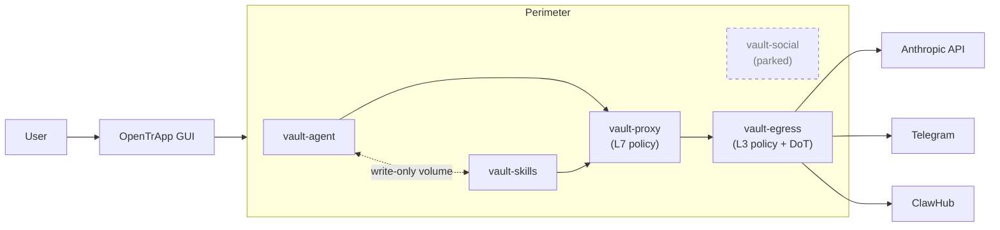

<p align="center">
  
</p>

# OpenTrApp

[](https://github.com/albertdobmeyer/opentrapp/actions/workflows/ci.yml)
[](https://github.com/albertdobmeyer/opentrapp/actions/workflows/codeql.yml)
[](https://scorecard.dev/viewer/?uri=github.com/albertdobmeyer/opentrapp)
[](https://www.bestpractices.dev/projects/12755)
[](LICENSE)

A desktop application that runs an autonomous CLI agent inside a five-container security perimeter on the user's own computer, with a Telegram interface for chat. Open-source under MIT. Ships pre-wired for [OpenClaw](https://www.getopenclaw.ai); the perimeter is designed to extend to other CLI agents.

For a one-page elevator explainer of the five-container perimeter, see [`docs/perimeter-explained.md`](docs/perimeter-explained.md). The full architecture, threat model, and per-component capabilities are in [`docs/trifecta.md`](docs/trifecta.md).

**Author:** [@albertdobmeyer](https://github.com/albertdobmeyer) · **Public landing page:** [opentrapp.com](https://opentrapp.com)

---

## Purpose

Autonomous CLI agents — [OpenClaw](https://www.getopenclaw.ai) is one prominent example — execute shell commands, read files, and load skills from third-party registries. Run with default settings, the agent has the same operating-system privileges as the user. The ClawHavoc study (2026-Q1) of one such registry classified 11.9 % of published skills as malicious (341 of 2,857). OpenTrApp wraps any such agent in a defense-in-depth perimeter to reduce the impact of agent compromise, malicious skills, and prompt-injection attacks. The shipped integration is OpenClaw; the perimeter is designed to extend to other CLI agents.

Reasoning is delegated to the agent's vendor API (Anthropic's, for OpenClaw); only the agent's execution layer (file work, tool calls, skill invocations) is local.

## Values

These are the principles that shape every design and product decision in this project. They are written down because the alternative — leaving them implicit — is how projects drift.

- **Safety-first, safety-always.** The perimeter exists because autonomous agents are powerful and powerful tools fail in expensive ways. Every architectural choice is evaluated against its containment effect first; convenience second. Defaults err on the restrictive side and are documented when they do.
- **Honest about residual risk.** The application can never claim to make running an autonomous agent absolutely safe. It raises the cost of compromise via defense-in-depth and is open about the gaps that remain. [**What this protects against — and what it doesn't**](docs/what-this-protects.md) is the plain-language summary; the [threat model](docs/threat-model.md) names every gap; the [whitepaper](docs/whitepaper.md) explains them.
- **Agent-agnostic, community-driven.** The perimeter is not coupled to any single CLI agent. The reference deployment is OpenClaw because OpenClaw exists today; the architecture is designed to extend to others. Contributions that broaden compatibility are welcomed.
- **Transparency over marketing.** No tracking, no telemetry, no proprietary blobs. Every dependency, every container layer, every external request is documentable from the source tree. Reproducibility steps are in [`docs/reproduce.md`](docs/reproduce.md).
- **Shared for the safety of the commons.** This project is MIT-licensed and developed in the open. Security research findings, hardening recipes, and threat-model deltas land in the repo where everyone running an autonomous CLI agent can benefit, not in private channels.

## Capabilities (default Split Shell)

- Telegram bot interface — message the agent from a paired phone
- File read/write within a sandboxed workspace; the host filesystem is not exposed to the container
- Image processing on Telegram-supplied content
- Skill loading from ClawHub gated by a 87-pattern scanner with MITRE-ATT&CK mapping and Content Disarm & Reconstruction
- 24-point startup verification of the perimeter topology
- API keys held by `vault-proxy` and injected per request; the agent container never reads the literal key

Web browsing, web fetch, and the broader OpenClaw tool surface are not enabled by default. They are available at "Soft Shell" via CLI configuration in v0.3.0; see [`workloads/agent/`](workloads/agent/).

## Skill scanner & Content Disarm & Reconstruction


The most novel piece of the project is the supply-chain defence in
[`workloads/skills/`](workloads/skills/). The ClawHavoc study (2026-Q1) found
**11.9 % of published ClawHub skills were malicious** (341 of 2,857) — the
gap container hardening doesn't close, because a malicious skill loaded by
the agent runs *as part of* the agent's reasoning. `vault-skills` runs a
layered defence — five stages, though not five fully-independent detectors:
stages 1, 2, and the post-install re-scan share the same pattern catalogue
(stage 2 is a specialised subset of stage 1). The genuinely distinct
mechanisms are three — a pattern blocklist, a default-deny line classifier,
and the parse-and-rebuild (CDR):

1. **87-pattern static scanner**, MITRE ATT&CK-mapped, calibrated to skills
   observed in real attacks (the ClawHavoc campaign + the `moltbook-ay`
   trojan).
2. **16-pattern prompt-injection detector** — instruction override, persona
   hijack, exfil directives, LLM control-token injection.
3. **Zero-trust line verifier** — every line of every file classified; a
   single unrecognised line quarantines the entire skill. Defence against
   novel attacks the pattern set hasn't been told about yet.
4. **Content Disarm & Reconstruction** — the original artefact is parsed
   into structured intent, then discarded; the skill that reaches the agent
   is rebuilt from scratch using only the parsed intent and clean templates.
   Bytes from the original never reach the agent. CDR is standard for email
   attachments; applying it to agent skills is, as far as we know, original.
5. **Post-install re-scan + suppression audit** — `.scanignore` ranges over
   50 lines are rejected; the scanner re-runs against the installed artefact.

The scanner, the injection patterns, the line verifier, and CDR are all
**agent-agnostic** — they work on the text and helper-script content any
markdown-based skill format ships, not on anything OpenClaw-specific. Adapting
forge to a different agent's skill registry is a connector question, not a
redesign.

**On cost (so there are no surprises).** Stages 1–3 and the re-scan are **pure
offline pattern matching — no model, no network**, and `vault-skills` is
**on-demand** (it isn't started with the perimeter and costs ~0 RAM at rest).
If you only ever *scan* skills, you download and run nothing extra. Only the
optional CDR *rebuild* (stage 4) needs an LLM, and it doesn't have to be a
dedicated download: point it at a **small local model (~1 GB, `qwen2.5-coder:1.5b`)
or at a model you already run** — any Ollama-native *or* OpenAI-compatible
endpoint (your agent's model, LM Studio, vLLM, a managed API) via
[`workloads/skills/config/cdr.conf`](workloads/skills/config/cdr.conf). The
rebuild is model-backed and best-effort, not bit-identical across runs; what it
guarantees is that the original file is never delivered and every rebuild is
re-scanned and signed before reaching the agent.

**Full narrative + the pitch to other CLI-agent maintainers:**
[`docs/skills-spotlight.md`](docs/skills-spotlight.md).

## Limitations

> **Start here:** [**What this protects against — and what it doesn't**](docs/what-this-protects.md) is a two-minute, plain-language summary of where the walls are and where the doors are. The points below and the [threat model](docs/threat-model.md) are the detailed version.

- This is experimental software. It is provided as-is, without warranty of any kind. The authors accept no responsibility for damage resulting from its use.
- Autonomous AI agent containment is an open research problem. The perimeter raises the cost of a successful compromise; it does not eliminate the possibility. The full attacker-capability matrix and residual-risk enumeration are in [`docs/threat-model.md`](docs/threat-model.md); the differential against alternative containment strategies (Firejail, gVisor, VM-only isolation, scanner-only, etc.) is in [`docs/why-not-x.md`](docs/why-not-x.md).
- The agent's reasoning is not local. Operating OpenTrApp without internet access to Anthropic's API is not supported.
- Installer binaries are signed with the Tauri auto-updater key, not with OS-level code-signing certificates. macOS Gatekeeper and Windows SmartScreen will display a first-launch warning.
- The social-feed workload (`vault-social`, formerly `vault-pioneer`) is **parked since 2026-05-03**. The target API (Moltbook) has been intermittent since 2026-04-05 following Meta's acquisition. The container is still defined in `compose.yml`; the code is preserved at [`workloads/social/`](workloads/social/). Re-aim to a generalized agent-to-agent social shield is tracked in MISSION.md (Thread C).

## Requirements

- 64-bit Linux, macOS (Apple Silicon or Intel), or Windows
- [Podman](https://podman.io/) or [Docker](https://www.docker.com/) installed and runnable by the current user
- Approximately 4 GB free disk space for the five container images
- An [Anthropic API key](https://console.anthropic.com/) and a Telegram bot token (the in-app setup wizard explains how to obtain both)
- *(Optional)* [Ollama](https://ollama.com/) running locally, for the on-device AI safety checks. Without it the fast built-in checks still run; the deeper AI second opinion simply holds anything uncertain for your review instead of judging it automatically. Pull the small local models it uses: `ollama pull qwen2.5-coder:1.5b`, `ollama pull qwen2.5-coder:3b`, and `ollama pull all-minilm`.

## Installation

Pre-built installers for all three platforms are attached to each [GitHub release](https://github.com/albertdobmeyer/opentrapp/releases/latest):

| Platform | Format |
|----------|--------|
| Linux    | `.deb`, `.rpm`, `.AppImage` |
| macOS    | `.dmg` (Apple Silicon and Intel) |
| Windows  | `.msi`, `.exe` |

The setup wizard verifies that Podman or Docker is installed and walks the user through API-key entry and Telegram pairing. No terminal interaction is required after install.

For unsupported platforms or to audit the build pipeline, see *Building from source* below.

---

<details>
<summary><strong>Architecture summary</strong></summary>

The runtime perimeter consists of five containers connected by per-service internal compose networks. The L7 (application-layer) policy and the L3 (network-layer) policy live in separate containers — see [ADR-0009](docs/adr/0009-five-container-perimeter.md) for the rationale.

| Container | Role | Description |
|-----------|------|-------------|
| `vault-agent`   | Runtime containment | Read-only root filesystem, all Linux capabilities dropped, custom syscall profile, workspace mount only |
| `vault-skills`   | Supply-chain defense | 87-pattern skill scanner, zero-trust line verifier, Content Disarm & Reconstruction pipeline |
| `vault-proxy`   | **L7 egress policy** | Domain allowlist, API-key injection, request logging, post-resolve destination-IP check. Holds API keys; **no internet attachment** (chains to `vault-egress`). |
| `vault-social` | Social-content analysis | **Parked** — see *Limitations* |
| `vault-egress`  | **L3 egress policy** | Kernel-level RFC1918 drop; pinned DoT resolver (Quad9 + Cloudflare); the *only* container with internet attachment. Holds `NET_ADMIN` but **no secrets**. |

`vault-proxy` is the bridge between the internal containers. `vault-egress` is the bridge to the public internet. Neither container holds both API credentials *and* elevated network capabilities — that separation is the load-bearing security property the five-container topology exists for.



Five Mermaid drawings (topology, trust tiers, network-isolation matrix, the skill-loading flow, the assistant-state machine) are in [`docs/diagrams.md`](docs/diagrams.md). The full architecture, attacker-capability matrix, defense-in-depth tables, and ownership matrix are in [`docs/trifecta.md`](docs/trifecta.md) and [`docs/threat-model.md`](docs/threat-model.md).

</details>

<details>
<summary><strong>Building from source</strong></summary>

Single monorepo (post [ADR-0013](docs/adr/0013-monorepo-consolidation.md)); no submodules.

```bash
git clone https://github.com/albertdobmeyer/opentrapp.git
cd opentrapp/app
npm install
npm run dev                              # frontend dev server
cd src-tauri && cargo build              # Rust backend
```

For a release-style desktop build, install Tauri's prerequisites for the target platform and run `cd app && npm run tauri build`.

### Test suite

```bash
cd app/src-tauri && cargo test --lib     # Rust unit tests (56 at v0.3.0)
cd app && npm test -- --run              # Vitest (74 at v0.3.0)
cd app && npx tsc --noEmit               # TypeScript strict
cd app && npx playwright test            # End-to-end (25)
bash tests/orchestrator-check.sh         # Manifest validation (42 checks)
podman compose up -d && podman compose down  # Perimeter smoke test
```

Continuous integration runs all of the above on every push to `main` and every release tag; see [`.github/workflows/ci.yml`](.github/workflows/ci.yml). For an end-to-end script that re-derives every numerical claim in this README from a fresh clone, see [`docs/reproduce.md`](docs/reproduce.md) and run [`bash docs/reproduce.sh`](docs/reproduce.sh).

Release artefacts are accompanied by a CycloneDX SBOM, a cosign keyless signature (sigstore), and a SLSA Build Level 2 build-provenance attestation. Verification:

```bash
# CycloneDX SBOM
syft scan packages:artefact.deb -o cyclonedx-json | diff - sbom.cyclonedx.json

# cosign signature (keyless / sigstore)
cosign verify-blob \
  --certificate sbom.cyclonedx.json.pem \
  --signature sbom.cyclonedx.json.sig \
  --certificate-identity "https://github.com/albertdobmeyer/opentrapp/.github/workflows/ci.yml@refs/tags/vX.Y.Z" \
  --certificate-oidc-issuer "https://token.actions.githubusercontent.com" \
  sbom.cyclonedx.json

# SLSA build provenance — see the `intoto.jsonl` asset on each release
cosign verify-attestation --type slsaprovenance ...
```

### Repository layout

```
opentrapp/                            (this repository — single monorepo)
├── app/                              Tauri 2 + React 18 desktop application (the orchestrator)
├── workloads/                        one directory per workload container
│   ├── agent/                          → vault-agent  (runtime containment)
│   ├── forge/                          → vault-skills  (supply-chain defense — skill scanner + CDR)
│   └── social/                         → vault-social (agent-social-feed analysis — parked)
├── infra/                            shared infrastructure containers
│   ├── proxy/                          → vault-proxy  (L7 egress policy)
│   └── egress/                         → vault-egress (L3 egress policy)
├── compose.yml                       5-service perimeter with network isolation
├── schemas/component.schema.json     workload manifest contract
└── config/orchestrator-workflows.yml cross-workload workflow definitions
```

See [`CLAUDE.md`](CLAUDE.md) for the full architecture specification and contribution rules.

</details>

---

## License

Released under the [MIT License](LICENSE). The license permits use, modification, redistribution, and inclusion in derivative works subject only to the attribution requirement (preservation of the copyright notice). No warranty is provided.
