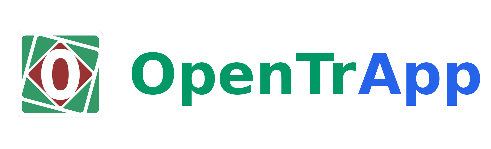
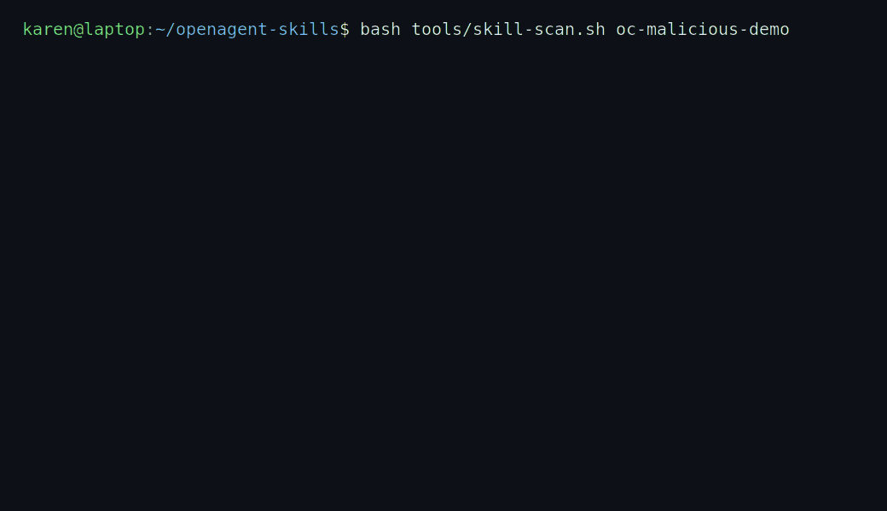

<p align="center">
  
</p>

# OpenTrApp

[](https://github.com/albertdobmeyer/opentrapp/actions/workflows/ci.yml)
[](https://github.com/albertdobmeyer/opentrapp/actions/workflows/codeql.yml)
[](https://scorecard.dev/viewer/?uri=github.com/albertdobmeyer/opentrapp)
[](https://www.bestpractices.dev/projects/12755)
[](LICENSE)

> **Status (2026-06-26):** The **lean-down campaign has shipped on `main`.** The Tauri/WebKitGTK desktop GUI is **deleted**, so OpenTrApp is now the lean, headless **`opentrapp-daemon`** plus an **on-demand browser projection** (the loopback `viewer-server`, rendering in your existing browser only while a dashboard is open), and the build is **GTK-free** (the 19 GTK3 advisories cleared; `Cargo.lock` has 0 `tauri`/`wry`/`webkit` entries). The perimeter itself is lean end to end: the credential-holding proxy is now a **15 MB Go chokepoint** (`elazarl/goproxy`) that replaced the leaky Python mitmproxy — putting the Python interpreter out of the keys-holding container ([ADR-0026](docs/adr/0026-vault-proxy-replacement-evaluation.md)) — and **every workload base is Alpine** (vault-skills 233→72 MB, vault-social 153→74 MB). The new proxy's **full live-boundary self-test is still pending** before it is claimed end-to-end correct. Cross-platform **installers for the new architecture are pending** ([cargo-dist, ADR-0023](docs/adr/0023-distribution-and-packaging.md)); until they ship, the new build runs **from source**, and the **last tagged release ([v0.8.0](https://github.com/albertdobmeyer/opentrapp/releases/latest)) is still the previous Tauri desktop app**. The CLI-first / registry direction continues per [ADR-0020](docs/adr/0020-product-identity-and-distribution.md). See [`CLAUDE.md`](CLAUDE.md) for the full target-versus-current framing.

A safer way to run an autonomous CLI agent on your own computer. OpenTrApp wraps the agent in a security perimeter built on two ideas. **Privilege separation:** no single container holds both your API keys and internet access, so a compromised agent can reach neither directly. **Supply-chain defense:** every skill the agent loads is vetted in isolation before it can reach the agent, because a malicious skill runs as part of the agent's own reasoning. Open-source under MIT.

It is pre-wired for [OpenClaw](https://www.getopenclaw.ai); the product is the perimeter itself, and the GUI is one optional, on-demand projection of it (see status above). The perimeter is agent-agnostic by design; opencode, Claude Code, and other CLI agents are candidates for support.

For a one-page explainer of how the perimeter works (one contained agent, two guards around it), see [`docs/perimeter-explained.md`](docs/perimeter-explained.md). The full architecture, threat model, and per-component capabilities are in [`docs/trifecta.md`](docs/trifecta.md).

**Author:** [@albertdobmeyer](https://github.com/albertdobmeyer) · **Public landing page:** [opentrapp.com](https://opentrapp.com)

---

## Try it, lowest commitment first

You do not have to adopt the whole perimeter to get value out of this.

**1. Scan your agent's skills in CI (one line, fully offline, no model).** The skill scanner runs as a GitHub Action, so any repository can gate its skills or plugins against malware and prompt injection before they ship:

```yaml
- uses: albertdobmeyer/opentrapp/actions/skill-scan@skill-scan-v1
  with: { path: ./skills }
```

Findings land in your repository's Security tab, and a finding fails the job. Details in [`actions/skill-scan/`](actions/skill-scan/).

**2. Scan a skill locally before you install it.** From a clone of this repo, the same offline check runs as a one-line pre-install gate, with no global install needed:

```bash
workloads/skills/skill scan ./that-plugin --strict || echo "blocked by the skill firewall"
```

**3. Run the full perimeter.** The latest tagged release ([v0.8.0](https://github.com/albertdobmeyer/opentrapp/releases/latest)) ships the previous Tauri desktop app with a setup wizard — the end-to-end containment story. The de-Tauri build on `main` (headless `opentrapp-daemon` + an on-demand browser dashboard) runs from source today; signed cross-platform installers for it are pending ([cargo-dist, ADR-0023](docs/adr/0023-distribution-and-packaging.md)).

---

## Purpose

Autonomous CLI agents, such as [OpenClaw](https://www.getopenclaw.ai), execute shell commands, read files, and load skills from third-party registries. Run with default settings, the agent has the same operating-system privileges as the user. The ClawHavoc study (2026-Q1) of one such registry classified 11.9% of published skills as malicious (341 of 2,857). OpenTrApp wraps any such agent in a defense-in-depth perimeter to reduce the impact of agent compromise, malicious skills, and prompt-injection attacks. The shipped integration is OpenClaw, and the perimeter is designed to extend to other CLI agents.

Reasoning is delegated to the agent's vendor API (Anthropic's, for OpenClaw); only the agent's execution layer (file work, tool calls, skill invocations) is local.

<p align="center">
  
</p>

<p align="center"><em>Privilege separation in one picture: the proxy holds your keys but has no route to the internet, and the egress filter has the route but never sees your keys.</em></p>

## Values

These are the principles that shape every design and product decision in this project. They are written down because the alternative, leaving them implicit, is how projects drift.

- **Safety-first, safety-always.** The perimeter exists because autonomous agents are powerful and powerful tools fail in expensive ways. Every architectural choice is evaluated against its containment effect first; convenience second. Defaults err on the restrictive side and are documented when they do.
- **Honest about residual risk.** The application can never claim to make running an autonomous agent absolutely safe. It raises the cost of compromise via defense-in-depth and is open about the gaps that remain. [**What this protects against, and what it doesn't**](docs/what-this-protects.md) is the plain-language summary; the [threat model](docs/threat-model.md) names every gap; the [whitepaper](docs/whitepaper.md) explains them.
- **Agent-agnostic, community-driven.** The perimeter is not coupled to any single CLI agent. The reference deployment is OpenClaw because OpenClaw exists today; the architecture is designed to extend to others. Contributions that broaden compatibility are welcomed.
- **Transparency over marketing.** No tracking, no telemetry, no proprietary blobs. Every dependency, every container layer, every external request is documentable from the source tree. Reproducibility steps are in [`docs/reproduce.md`](docs/reproduce.md).
- **Shared for the safety of the commons.** This project is MIT-licensed and developed in the open. Security research findings, hardening recipes, and threat-model deltas land in the repo where everyone running an autonomous CLI agent can benefit, not in private channels.
- **Lean by design, runs on modest hardware.** OpenTrApp is a lean background app. The full perimeter and its boundary self-test must run on a 7.2 GB laptop, the hard floor; idle auto-pause collapses the agent toward zero RAM between tasks. If what we build does not run on that machine, we have failed.
- **Bleeding-edge agentic security, at the highest bar.** This project works toward the highest standards for autonomous-agent containment and supply-chain defense, grounded in empirical threat research (the ClawHavoc study found 11.9% of published skills malicious). The goal is best-in-class, not good-enough.
- **An enabler, not a gatekeeper.** The aim is to let as many people as possible run open-source CLI agents and agentic systems safely, with or without an orchestrating vendor AI such as Claude Code. You operate OpenTrApp directly, or a trusted host agent does it for you; either way the contained agent stays caged and boundary-weakening stays human-gated. No lock-in.

## Capabilities (default Split Shell)

- Telegram bot interface for messaging the agent from a paired phone
- File read/write within a sandboxed workspace; the host filesystem is not exposed to the container
- Image processing on Telegram-supplied content
- Skill loading from ClawHub gated by an 87-pattern scanner (MITRE ATT&CK-mapped, including 16 prompt-injection patterns) and Content Disarm & Reconstruction
- 24-point startup verification of the perimeter topology
- API keys held by `vault-proxy` and injected per request; the agent container never reads the literal key

Web browsing, web fetch, and the broader OpenClaw tool surface are not enabled by default. They are available at the "Soft Shell" tier via configuration; see [`workloads/agent/`](workloads/agent/).

## Skill scanner & Content Disarm & Reconstruction



The most novel piece of the project is the supply-chain defense in
[`workloads/skills/`](workloads/skills/). The ClawHavoc study (2026-Q1) found
**11.9% of published ClawHub skills were malicious** (341 of 2,857). That is the
gap container hardening doesn't close, because a malicious skill loaded by the
agent runs *as part of* the agent's reasoning. `vault-skills` runs a layered
defense of five stages, though not five fully-independent detectors: stages 1,
2, and the post-install re-scan share the same pattern catalogue (stage 2 is a
specialised subset of stage 1). The three genuinely distinct mechanisms are a
pattern blocklist, a default-deny line classifier, and the parse-and-rebuild
(CDR):

1. **87-pattern static scanner**, MITRE ATT&CK-mapped, calibrated to skills
   observed in real attacks (the ClawHavoc campaign + the `moltbook-ay`
   trojan).
2. **16-pattern prompt-injection detector** covering instruction override,
   persona hijack, exfil directives, and LLM control-token injection.
3. **Zero-trust line verifier**: every line of every file is classified, and a
   single unrecognised line quarantines the entire skill. This is the defense
   against novel attacks the pattern set hasn't been told about yet.
4. **Content Disarm & Reconstruction**: the original artefact is parsed into
   structured intent, then discarded. The skill that reaches the agent is
   rebuilt from scratch using only the parsed intent and clean templates, so
   bytes from the original never reach the agent. CDR is standard for email
   attachments; applying it to agent skills is, as far as we know, original.
5. **Post-install re-scan and suppression audit**: `.scanignore` ranges over
   50 lines are rejected, and the scanner re-runs against the installed artefact.

<p align="center">
  
</p>

<p align="center"><em>Content Disarm and Reconstruction: the original skill is parsed for intent and then discarded, so only a clean rebuild reaches the agent.</em></p>

The scanner, the injection patterns, the line verifier, and CDR are all
**agent-agnostic**. They work on the text and helper-script content any
markdown-based skill format ships, not on anything OpenClaw-specific. Adapting
the scanner to a different agent's skill registry is a connector question, not a
redesign, and the offline scanner already runs standalone as a command-line
check you can drop into any agent's plugin-install step.

**On cost (so there are no surprises).** Stages 1 to 3 and the re-scan are **pure
offline pattern matching, with no model and no network**, and `vault-skills` is
**on-demand** (it isn't started with the perimeter and costs roughly 0 RAM at
rest). If you only ever *scan* skills, you download and run nothing extra. Only
the optional CDR *rebuild* (stage 4) needs a model, and it doesn't have to be a
dedicated download: point it at a **small local model (about 1 GB,
`qwen2.5-coder:1.5b`) or at a model you already run**, whether an Ollama-native
or OpenAI-compatible endpoint (your agent's model, LM Studio, vLLM, or a managed
API), via [`workloads/skills/config/cdr.conf`](workloads/skills/config/cdr.conf).
The rebuild is model-backed and best-effort, not bit-identical across runs. What
it guarantees is that the original file is never delivered, and every rebuild is
re-scanned and signed before reaching the agent.

**Full narrative + the pitch to other CLI-agent maintainers:**
[`docs/skills-spotlight.md`](docs/skills-spotlight.md).

## For the skeptical

**"Isn't this just a container sandbox? Why not gVisor, Firejail, or a VM?"**
A sandbox is necessary but not sufficient, and OpenTrApp uses one. The two parts a generic sandbox does not give you are the reason this project exists. First, a privilege split: the container holding your API keys has no internet route, and the container with the internet route holds no keys, so compromising one yields neither exfiltration nor credential theft. Second, skill defense: sandboxing the agent does not contain a malicious skill, because the skill runs as part of the agent's own reasoning. The point-by-point comparison against Firejail, gVisor, VM-only isolation, and scanner-only tools is in [`docs/why-not-x.md`](docs/why-not-x.md).

**"Is the boundary actually verified, or is this a claim?"**
The perimeter ships with an automated boundary self-test: network isolation, the egress allowlist, credential injection, the L3 filter, and a proxy-CA pin, with the rule that a resumed perimeter must pass the same checks as a cold one. Full verification on real hardware is in progress, and until it is green the honest position is that any "it holds" statement is in progress, not done. The [threat model](docs/threat-model.md) names every residual gap.

**"Does Content Disarm and Reconstruction break legitimate skills?"**
The offline scan and verify, which is the wedge and what the Action runs, do not rebuild anything; they read and classify. Only the optional CDR rebuild reconstructs a skill. That rebuild is model-backed and best-effort rather than bit-identical, and it errs conservative: a single unrecognised line quarantines the whole skill. What it guarantees is that the original bytes are never delivered and every rebuild is re-scanned before it reaches the agent.

**"Why five containers? Is that not overkill?"**
Four are load-bearing and one (the agent-social shield) is opt-in and off by default. The count exists for the privilege split above: separating the L7 application-layer policy from the L3 network-layer policy is what lets "holds the keys" and "can reach the internet" sit in different trust domains. See [ADR-0009](docs/adr/0009-five-container-perimeter.md).

**"It is solo and early. Why should I trust it?"**
You should not trust it on reputation, and the project does not ask you to. It is MIT, built entirely in public, with an OpenSSF Best Practices badge, signed releases, a public threat model, and a reproducible-build recipe. The most useful thing you can do is review it adversarially, which is exactly what the project is asking for below.

## Limitations

> **Start here:** [**What this protects against, and what it doesn't**](docs/what-this-protects.md) is a two-minute, plain-language summary of where the walls are and where the doors are. The points below and the [threat model](docs/threat-model.md) are the detailed version.

- This is experimental software. It is provided as-is, without warranty of any kind. The authors accept no responsibility for damage resulting from its use.
- Autonomous AI agent containment is an open research problem. The perimeter raises the cost of a successful compromise; it does not eliminate the possibility. The full attacker-capability matrix and residual-risk enumeration are in [`docs/threat-model.md`](docs/threat-model.md); the differential against alternative containment strategies (Firejail, gVisor, VM-only isolation, scanner-only, etc.) is in [`docs/why-not-x.md`](docs/why-not-x.md).
- The agent's reasoning is not local. Operating OpenTrApp without internet access to Anthropic's API is not supported.
- Installer binaries are signed with the Tauri auto-updater key, not with OS-level code-signing certificates. macOS Gatekeeper and Windows SmartScreen will display a first-launch warning.
- The agent-social workload (`vault-social`, formerly `vault-pioneer`) is **opt-in / on-demand**, and its full build-out is **deferred** (the third concern, after Vault/Skill/GUI). The original Moltbook target was parked 2026-05-03 (Meta's acquisition); a live AT Protocol (Bluesky) adapter has since shipped ([ADR-0017](docs/adr/0017-unpark-social-live-adapter.md)). The container is defined in `compose.yml` (off by default); code at [`workloads/social/`](workloads/social/). Tracked in MISSION.md (Thread C).

## Requirements

- 64-bit Linux, macOS (Apple Silicon or Intel), or Windows
- [Podman](https://podman.io/) or [Docker](https://www.docker.com/) installed and runnable by the current user
- Approximately 4 GB free disk space for the five container images
- An [Anthropic API key](https://console.anthropic.com/) and a Telegram bot token (the in-app setup wizard explains how to obtain both)
- *(Optional)* [Ollama](https://ollama.com/) running locally, for the on-device AI safety checks. Without it the fast built-in checks still run; the deeper AI second opinion simply holds anything uncertain for your review instead of judging it automatically. Pull the small local models it uses: `ollama pull qwen2.5-coder:1.5b`, `ollama pull qwen2.5-coder:3b`, and `ollama pull all-minilm`.

## Installation

Pre-built installers for all three platforms are attached to each [GitHub release](https://github.com/albertdobmeyer/opentrapp/releases/latest):

| Platform | Format |
|----------|--------|
| Linux    | `.deb`, `.rpm`, `.AppImage` |
| macOS    | `.dmg` (Apple Silicon and Intel) |
| Windows  | `.msi`, `.exe` |

The setup wizard verifies that Podman or Docker is installed and walks the user through API-key entry and Telegram pairing. No terminal interaction is required after install.

For unsupported platforms or to audit the build pipeline, see *Building from source* below.

---

<details>
<summary><strong>Architecture summary</strong></summary>

The runtime perimeter consists of five containers connected by per-service internal compose networks. The L7 (application-layer) policy and the L3 (network-layer) policy live in separate containers; see [ADR-0009](docs/adr/0009-five-container-perimeter.md) for the rationale.

| Container | Role | Description |
|-----------|------|-------------|
| `vault-agent`   | Runtime containment | Read-only root filesystem, all Linux capabilities dropped, custom syscall profile, workspace mount only |
| `vault-skills`   | Supply-chain defense | 87-pattern skill scanner, zero-trust line verifier, Content Disarm & Reconstruction pipeline |
| `vault-proxy`   | **L7 egress policy** | Domain allowlist, API-key injection, request logging, post-resolve destination-IP check. Holds API keys; **no internet attachment** (chains to `vault-egress`). |
| `vault-social` | Agent-social analysis | **Opt-in / on-demand**; build-out deferred (see *Limitations*) |
| `vault-egress`  | **L3 egress policy** | Kernel-level RFC1918 drop; pinned DoT resolver (Quad9 + Cloudflare); the *only* container with internet attachment. Holds `NET_ADMIN` but **no secrets**. |

`vault-proxy` is the bridge between the internal containers. `vault-egress` is the bridge to the public internet. Neither container holds both API credentials *and* elevated network capabilities. That separation is the load-bearing security property the five-container topology exists for.


Five Mermaid drawings (topology, trust tiers, network-isolation matrix, the skill-loading flow, the assistant-state machine) are in [`docs/diagrams.md`](docs/diagrams.md). The full architecture, attacker-capability matrix, defense-in-depth tables, and ownership matrix are in [`docs/trifecta.md`](docs/trifecta.md) and [`docs/threat-model.md`](docs/threat-model.md).

</details>

<details>
<summary><strong>Building from source</strong></summary>

Single monorepo (post [ADR-0013](docs/adr/0013-monorepo-consolidation.md)); no submodules.

```bash
git clone https://github.com/albertdobmeyer/opentrapp.git
cd opentrapp/app
npm install
npm run dev                              # frontend dev server
cd src-tauri && cargo build              # Rust backend
```

For a release build of the headless product, build the Rust binaries and the frontend: `cd app/src-tauri && cargo build --release -p opentrapp-daemon -p viewer-server`, then `cd app && npm run build`. Signed cross-platform installer packaging (cargo-dist) is pending — [ADR-0023](docs/adr/0023-distribution-and-packaging.md).

### Test suite

```bash
cd app/src-tauri && cargo test --lib     # Rust unit tests
cd app && npm test -- --run              # Vitest unit tests
cd app && npx tsc --noEmit               # TypeScript strict
cd app && npx playwright test            # End-to-end tests
bash tests/orchestrator-check.sh         # Manifest validation (114 checks)
podman compose up -d && podman compose down  # Perimeter smoke test
```

Continuous integration runs all of the above on every push to `main` and every release tag; see [`.github/workflows/ci.yml`](.github/workflows/ci.yml). For an end-to-end script that re-derives every numerical claim in this README from a fresh clone, see [`docs/reproduce.md`](docs/reproduce.md) and run [`bash docs/reproduce.sh`](docs/reproduce.sh).

Release artefacts are accompanied by a CycloneDX SBOM, a cosign keyless signature (sigstore), and a SLSA Build Level 2 build-provenance attestation. Verification:

```bash
# CycloneDX SBOM
syft scan packages:artefact.deb -o cyclonedx-json | diff - sbom.cyclonedx.json

# cosign signature (keyless / sigstore)
cosign verify-blob \
  --certificate sbom.cyclonedx.json.pem \
  --signature sbom.cyclonedx.json.sig \
  --certificate-identity "https://github.com/albertdobmeyer/opentrapp/.github/workflows/ci.yml@refs/tags/vX.Y.Z" \
  --certificate-oidc-issuer "https://token.actions.githubusercontent.com" \
  sbom.cyclonedx.json

# SLSA build provenance: see the `intoto.jsonl` asset on each release
cosign verify-attestation --type slsaprovenance ...
```

### Repository layout

```
opentrapp/                            (this repository, single monorepo)
├── app/                              React 18 frontend + the Rust workspace (core · daemon · viewer-server); the Tauri desktop crate was removed in the de-Tauri cutover
├── workloads/                        one directory per workload container
│   ├── agent/                          → vault-agent  (runtime containment)
│   ├── forge/                          → vault-skills  (supply-chain defense: skill scanner + CDR)
│   └── social/                         → vault-social (agent-social analysis: opt-in, deferred)
├── infra/                            shared infrastructure containers
│   ├── proxy/                          → vault-proxy  (L7 egress policy)
│   └── egress/                         → vault-egress (L3 egress policy)
├── compose.yml                       5-service perimeter with network isolation
├── schemas/component.schema.json     workload manifest contract
└── config/orchestrator-workflows.yml cross-workload workflow definitions
```

See [`CLAUDE.md`](CLAUDE.md) for the full architecture specification and contribution rules.

</details>

---

## How it got here

<p align="center">
  
</p>

OpenTrApp began as a single container around OpenClaw, became Lobster-TrApp, and grew into the five-container perimeter before the rebrand. The standalone Skill Firewall is shipped today. The headless daemon and the agent-operable CLI further along the timeline are the ratified direction ([ADR-0020](docs/adr/0020-product-identity-and-distribution.md)), not yet shipped.

## Contributing, and please tear it apart

This is an early, solo project, and the single most valuable contribution is adversarial review. Read the [threat model](docs/threat-model.md) and tell me where the perimeter leaks, where the scanner is bypassable, or where a claim outruns its evidence. Code reviewers and a co-maintainer are especially welcome. Open an issue, open a pull request, or ask and I will point you at a good place to start.

See [`CONTRIBUTING.md`](CONTRIBUTING.md) for the build, test gates, DCO sign-off, and pull-request workflow.

| Document | What it covers |
|----------|----------------|
| [`docs/roadmap.md`](docs/roadmap.md) | Where the project is heading and what is explicitly *not* promised |
| [`docs/governance.md`](docs/governance.md) | How decisions are made, the maintainer path, and the honest bus-factor |
| [`docs/assurance-case.md`](docs/assurance-case.md) | The structured security argument (claims → evidence) |
| [`docs/threat-model.md`](docs/threat-model.md) | Attacker categories and named residual gaps |
| [`CODE_OF_CONDUCT.md`](CODE_OF_CONDUCT.md) | Participation standards |
| [`SECURITY.md`](SECURITY.md) | Private vulnerability disclosure |

## License

Released under the [MIT License](LICENSE). The license permits use, modification, redistribution, and inclusion in derivative works subject only to the attribution requirement (preservation of the copyright notice). No warranty is provided.
