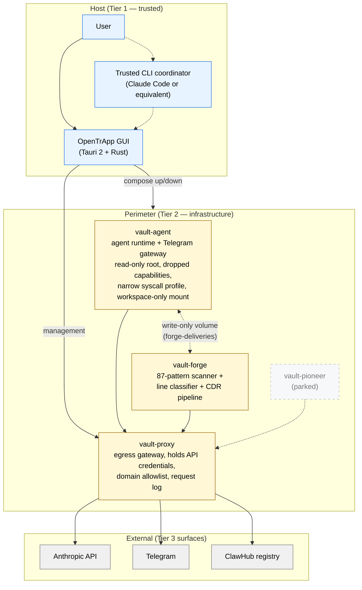
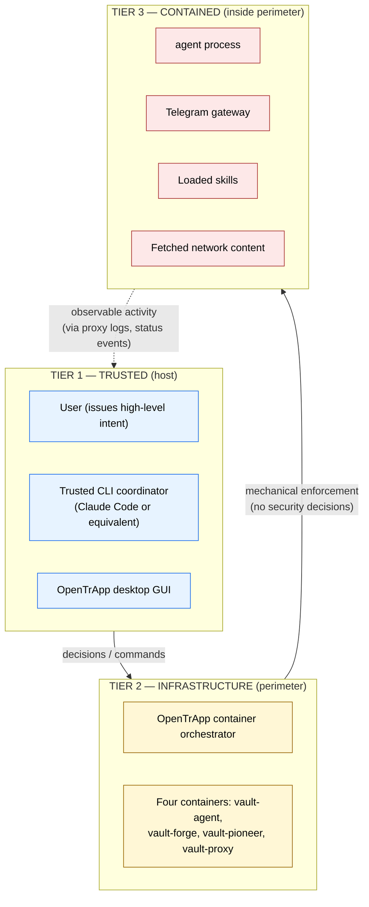
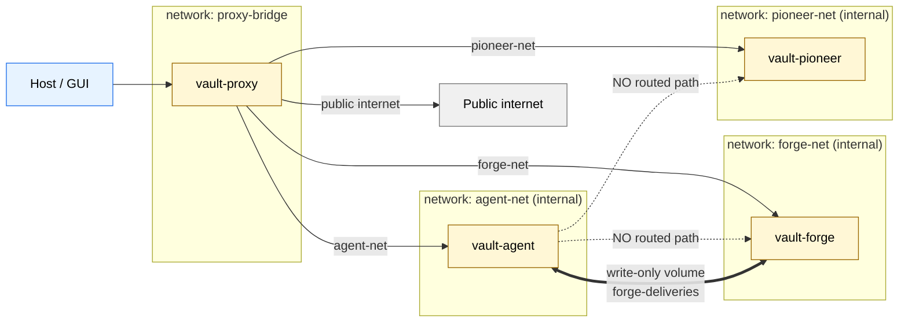
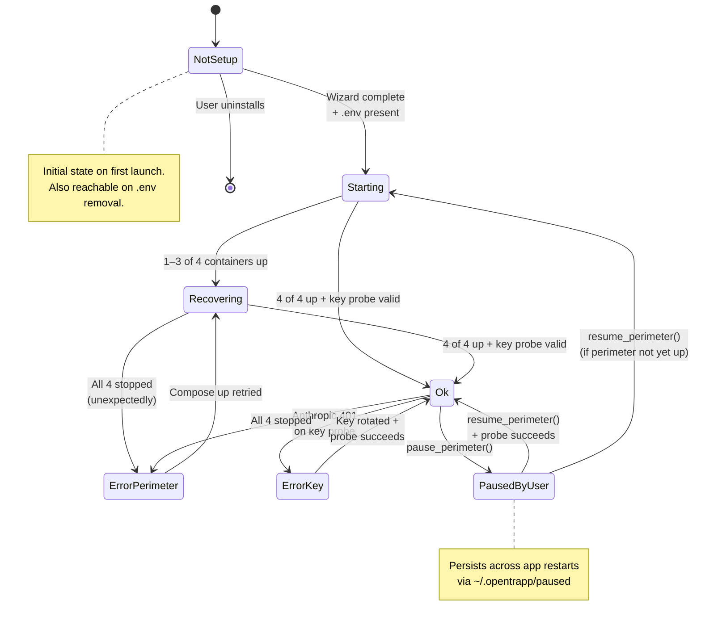

# Architecture diagrams

**Document status:** Active
**Created:** 2026-05-04
**Companion documents:** [`trifecta.md`](trifecta.md) (architecture); [`whitepaper.md`](whitepaper.md) (paper-form treatment); [`threat-model.md`](threat-model.md) (attacker model).

This document collects the visual representations of the architecture in [Mermaid](https://mermaid.js.org/) form. GitHub renders Mermaid blocks natively, so all diagrams live as code in this Markdown file with no binary asset drift. Each diagram is captioned and references the source-of-truth file (`compose.yml`, `status_aggregator.rs`, `tool-control.sh`, etc.) it visualises, so a reviewer noticing a mismatch can correct it from a single trail.

ASCII fallbacks remain in the original architecture documents ([`trifecta.md`](trifecta.md), [`whitepaper.md`](whitepaper.md)) for readers on platforms that do not render Mermaid; the Mermaid sources here are the canonical drawings.

---

## 1. Four-container perimeter topology

Source of truth: [`compose.yml`](../compose.yml).



**Reading guide.** Solid arrows are routed network paths; the dashed double-arrow between `vault-agent` and `vault-forge` is the write-only `forge-deliveries` shared volume (no routed network path exists between them). The dotted line from `vault-pioneer` indicates the parked status. The four boxes inside *Perimeter* are the four containers in `compose.yml`'s `services:` map; the four arrows from Perimeter to External enumerate the only egress destinations the proxy allowlist permits.

---

## 2. Trust tiers

Source of truth: [`trifecta.md`](trifecta.md) §2.



**Reading guide.** Tier 1 makes decisions; Tier 2 mechanically enforces them; Tier 3 performs the work. The dotted return arrow (Tier 3 → Tier 1) is *observation*, not authorisation: Tier 3 cannot promote itself; it can only act within the boundaries Tier 2 enforces and produce activity that Tier 1 then observes.

---

## 3. Network-isolation matrix

Source of truth: `compose.yml` `networks:` section and the matrix in [`trifecta.md`](trifecta.md) §3.



**Reading guide.** Each container has its own `internal: true` network; only `vault-proxy` is dual-homed onto each. Solid arrows are the only routed paths; the dotted lines from `vault-agent` to `vault-forge` and `vault-pioneer` are emphatically *not-paths* (drawn for clarity, to make the absence visible). The `==>` line is the `forge-deliveries` shared volume — a unidirectional file-system surface, not a network path. Public-internet egress is the single arrow from `vault-proxy`; no other container has a path out.

---

## 4. Agent-skill-loading flow (the CDR pipeline)

Source of truth: [`adr/0003-content-disarm-reconstruction.md`](adr/0003-content-disarm-reconstruction.md) and [`components/openskill-forge/tools/skill-cdr.sh`](../components/openskill-forge/tools/skill-cdr.sh).

```mermaid
sequenceDiagram
    participant U as User (via GUI)
    participant K as Trusted coordinator (Karen)
    participant F as vault-forge
    participant P as vault-proxy
    participant V as forge-deliveries volume
    participant A as vault-agent

    U->>K: "Install skill X from ClawHub"
    K->>F: forge.fetch_skill(X)
    F->>P: HTTPS GET clawhub.ai/skills/X
    P-->>F: skill bundle (quarantined)

    F->>F: 87-pattern static scan
    Note over F: Reject on CRITICAL hit;<br/>otherwise continue

    F->>F: Zero-trust line classifier
    Note over F: Every line classified<br/>SAFE / SUSPICIOUS / MALICIOUS;<br/>any non-SAFE quarantines

    F->>F: Parse intent → structural model
    F->>F: Reconstruct skill from intent
    Note over F: Original artefact discarded;<br/>clean version generated;<br/>SHA-256 clearance report signed

    F->>V: Write certified skill (write-only mount)
    F-->>K: forge.scan_complete(verdict)

    K->>U: "Skill X passed; install? (Y/N)"
    U->>K: "Yes"
    K->>A: vault.install_skill(X, hash)

    A->>V: Read certified skill
    A->>A: Verify hash matches signed report
    Note over A: Reject if hash mismatch
    A-->>K: install_complete

    K->>U: "Skill X installed at Split Shell"
```

**Reading guide.** The path from ClawHub to `vault-agent` is one-way through the perimeter: `vault-proxy` mediates the egress; `vault-forge` runs the pipeline offline (no further network access during scan / classify / parse / rebuild); the `forge-deliveries` volume is the single delivery channel into `vault-agent`. The agent verifies the SHA-256 hash on every load; a side-loaded skill that bypassed forge will fail this check and be refused. The user explicit-approval gate (`"Skill X passed; install? (Y/N)"`) is the friction layer the architecture relies on for the Telegram-first, click-to-install case.

---

## 5. AssistantStatus state machine

Source of truth: [`app/src-tauri/src/status_aggregator.rs`](../app/src-tauri/src/status_aggregator.rs) (the `AssistantStatus` enum + the `evaluate()` function).



**Reading guide.** Seven states. `Ok` is the steady state; `ErrorKey` and `ErrorPerimeter` are the two failure modes the user is shown directly; `PausedByUser` is the user-controlled hold that persists across application restarts via the marker file. The aggregator re-evaluates the status every 60 seconds and emits a Tauri event on transition; the React frontend's hero state-machine subscribes to this event. The full transition matrix is exercised by the Rust unit tests at [`app/src-tauri/src/status_aggregator.rs`](../app/src-tauri/src/status_aggregator.rs) (`tests::*` near line 442).

---

## How these diagrams stay accurate

Each diagram cites a source-of-truth file. When that file changes, the diagram in this document is reviewed for whether it still accurately depicts the source. Specifically:

- **Diagram 1 (topology):** updated when `compose.yml`'s `services:` map changes.
- **Diagram 2 (trust tiers):** updated when [`trifecta.md`](trifecta.md) §2 is rewritten.
- **Diagram 3 (network isolation):** updated when `compose.yml`'s `networks:` section changes.
- **Diagram 4 (CDR pipeline):** updated when [`adr/0003-content-disarm-reconstruction.md`](adr/0003-content-disarm-reconstruction.md) is amended or when the pipeline scripts change shape.
- **Diagram 5 (AssistantStatus):** updated when `status_aggregator.rs`'s `AssistantStatus` enum or the `evaluate()` function changes.

A pull-request that touches any of these source files should also touch this document if the diagram needs updating.

---

## Cross-references

- [`README.md`](../README.md) embeds Diagrams 1 and 5 directly; the others are linked from the *Architecture summary* section.
- [`trifecta.md`](trifecta.md) embeds Diagrams 1 and 3 next to their ASCII fallbacks.
- [`whitepaper.md`](whitepaper.md) §3.2 cites Diagram 1; §6 cites Diagram 4.
