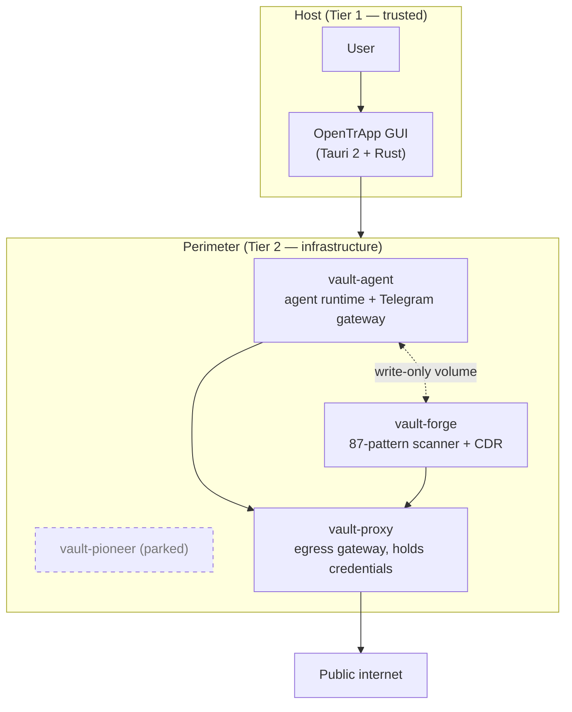

# Architecture — Perimeter Defense for Autonomous CLI Agents

**Updated:** 2026-05-03
**Supersedes:** Previous version (2026-04-15)
**Origin design spec (archived):** [`docs/archive/superpowers/2026-04-15-architecture-v2-perimeter-redesign.md`](archive/superpowers/2026-04-15-architecture-v2-perimeter-redesign.md) — the seminal architecture-v2 design document. This document supersedes it.

This document describes the security architecture of OpenTrApp: the problem it addresses, the threat model, the container topology, and how the components compose into a single defensive perimeter around an autonomous AI agent.

---

## 1. Problem statement

Autonomous CLI agents — [OpenClaw](https://www.getopenclaw.ai) is the reference deployment for this work, and the example used throughout this document — execute shell commands, read files, control browsers, send messages, and dynamically load skills from third-party registries. Run with default settings on a personal computer, such an agent has the same operating-system privileges as the user, so any compromise — a prompt injection attack, a malicious skill, or a flaw in the agent itself — translates directly into damage to the user's system or accounts.

Three categories of untrusted input reach the agent during normal operation:

1. **Runtime inputs** — user prompts, agent self-generated reasoning, and intermediate tool outputs that the agent processes inside its own context window.
2. **Supply-chain inputs** — skills downloaded from the [ClawHub](https://www.clawhub.ai) registry. The ClawHavoc study (2026-Q1) classified 341 of 2,857 published ClawHub skills (11.9 %) as malicious.
3. **Network and social inputs** — content fetched from the web or from agent-to-agent social platforms, which is now well-documented as a prompt-injection vector.

A single defensive layer — a hardened container, a static skill scanner, or a network filter — is insufficient because each layer has a known failure mode (misconfiguration, missing pattern, encoded payload bypass). The mitigation strategy adopted here is defense-in-depth across an isolated perimeter, with all untrusted content kept inside hardened containers and never reaching the host filesystem.

A second design choice is **adaptive restriction**: the agent's privilege level is treated as a system state set per-context, rather than a single configuration value chosen at install time.

---

## 2. Trust tiers

```
TIER 1 — TRUSTED (host)
  user (issues high-level instructions)
  trusted CLI coordinator (Claude Code or equivalent — translates intent into operations)
  OpenTrApp desktop GUI

TIER 2 — INFRASTRUCTURE (perimeter)
  OpenTrApp container orchestrator
  4 containers: vault-agent, vault-forge, vault-pioneer, vault-proxy

TIER 3 — CONTAINED (inside perimeter)
  agent process
  Telegram gateway
  Loaded skills
  Fetched network content
```

Tier 1 components run on the user's host with full filesystem and network access. They make decisions and issue commands. Tier 2 enforces boundaries mechanically — it does not make security decisions, only carries them out. Tier 3 performs the actual work the user wants done, within the boundaries Tier 2 enforces.

---

## 3. Container topology

A Mermaid drawing of the topology, the network-isolation matrix, the trust tiers, the skill-loading flow, and the AssistantStatus state machine is collected in [`diagrams.md`](diagrams.md). For convenience the topology rendering is reproduced below.



The ASCII tree below preserves the same content for readers on platforms without Mermaid rendering.

```
HOST
│
├── OpenTrApp GUI (Tauri 2 + Rust)
│
└── Perimeter (Podman/Docker compose network)
    │
    ├── vault-agent
    │     agent runtime, Telegram gateway, CLI agents
    │     Read-only root filesystem, all Linux capabilities dropped,
    │     custom seccomp profile, workspace mount only
    │     Adaptive shell controls allowed tool surface
    │
    ├── vault-forge
    │     Skill scanner: 87 MITRE-ATT&CK-mapped patterns
    │     Content Disarm & Reconstruction (CDR) pipeline
    │     Untrusted skill files are downloaded into this container,
    │     scanned, rebuilt from semantic intent, and delivered to
    │     vault-agent via a write-only shared volume
    │     Network isolated from vault-agent
    │
    ├── vault-pioneer (parked — see §8)
    │     Originally: scan posts on the Moltbook agent social
    │     network for prompt-injection patterns
    │     Container is defined; target API has been intermittent
    │     since 2026-04-05 following Meta's acquisition of Moltbook
    │
    └── vault-proxy
          Sole egress to the public internet
          Holds API keys; injects them per request, so no other
          container ever sees the literal key value
          Domain allowlist, payload-size limits, request logging
          Internal network bridge between the other three containers
          (which otherwise have no path to one another)
```

### Network isolation matrix

Each container has its own internal network. Only `vault-proxy` bridges them.

| Source              | Destination       | Allowed | Purpose |
|---------------------|-------------------|---------|---------|
| vault-agent         | vault-proxy       | Yes     | Filtered, key-injected, logged egress |
| vault-agent         | vault-forge       | No      | Prevents the agent from influencing skill scans |
| vault-agent         | vault-pioneer     | No      | Prevents the agent from influencing feed analysis |
| vault-agent         | host              | No      | No host-side filesystem or process visibility |
| vault-forge         | vault-proxy       | Yes     | Skill download via filtered egress |
| vault-forge         | vault-agent       | Volume only | Delivers certified skills via write-only mount |
| vault-pioneer       | vault-proxy       | Yes     | Feed fetch via filtered egress |
| vault-proxy         | public internet   | Yes     | The only external connection |
| host (GUI / coordinator) | vault-proxy  | Yes     | Management, monitoring, control |

---

## 4. Components

### 4.1 opencli-container — runtime containment

The core runtime layer. Wraps the agent in a hardened container with a six-layer defense profile:

- Read-only root filesystem; writable scratch is mounted at a single workspace path
- All Linux capabilities dropped at container start
- Custom seccomp profile blocking privileged syscalls
- Network policy limited to the proxy bridge
- Tool-control layer that filters which OpenClaw tools the LLM is even told about
- Three-level kill switch (graceful stop, container kill, full perimeter teardown)

Verified at startup by a 24-point security check covering filesystem permissions, network reachability, capability set, mount layout, and tool-policy consistency.

### 4.2 openskill-forge — supply-chain defense

Runs as `vault-forge`, isolated from the agent at the network layer. Implements three defenses against malicious skills:

- **Static scanner** — 87 patterns mapped to MITRE ATT&CK techniques. Detects credential exfiltration, persistence, command-and-control, defense-evasion, and other indicators on the skill source itself.
- **Zero-trust line verifier** — every line of every skill is classified before the rebuilt artifact is approved.
- **Content Disarm & Reconstruction** — the original artifact is discarded; a clean version is rebuilt from the parsed semantic intent.

Output is delivered to `vault-agent` via a write-only volume. The agent has no path to influence the scanner; a compromised agent cannot bypass the supply-chain check by talking to forge directly because no such path exists.

### 4.3 openagent-social — social-content analysis (parked)

Runs as `vault-pioneer`. Built to scan posts on Moltbook, an AI-agent social network, for prompt-injection patterns before the content was relayed to `vault-agent`. The container is still defined in `compose.yml`. The target API has been intermittent since 2026-04-05 following Meta's acquisition of Moltbook (2026-03-10), so the module has been parked since 2026-05-03; see [§8 Status](#8-status). Code, threat-pattern catalog (25 patterns), and platform-anatomy notes are preserved in [`components/openagent-social/`](../components/openagent-social/).

### 4.4 vault-proxy — egress gateway

The single point of contact between the perimeter and the public internet. Implemented as an mitmproxy-based addon that:

- Holds the user's API keys (`ANTHROPIC_API_KEY`, `TELEGRAM_BOT_TOKEN`) in environment variables visible only to itself
- Replaces a placeholder string in outbound requests with the real key, so no other container ever has the literal key
- Enforces a domain allowlist; requests to unallowlisted hosts are rejected with a logged 403
- Records every request (timestamp, host, status, byte counts) to a structured log readable by the host
- Bridges the otherwise-isolated networks of `vault-agent`, `vault-forge`, and `vault-pioneer`

---

## 5. Adaptive shell

Privilege level is treated as a system state, set per context, rather than a permanent configuration. Three shell levels are defined:

| Level       | Allowed                                                                 | Denied (in addition to host access, root, SSH keys, password stores) |
|-------------|-------------------------------------------------------------------------|----------------------------------------------------------------------|
| Hard Shell  | Telegram chat only                                                      | All command execution, file I/O, web browsing, skill loading         |
| Split Shell | File read/write in the workspace; safelisted shell commands with per-action approval | Commands not on the safelist; arbitrary network fetches              |
| Soft Shell  | Web browsing, autonomous safelisted commands, scheduled tasks, the broader OpenClaw tool surface | Host-level resources, credential stores, administrative operations   |

Default is Split Shell. Soft Shell is opt-in via CLI configuration in v0.3.0; a future revision will surface the toggle in the GUI behind a confirmation step.

The shell is "adaptive" because the trusted CLI coordinator (Claude Code or equivalent) can switch levels in response to task context — for example, dropping to Hard Shell while the agent processes untrusted feed content, returning to Split Shell when the agent is back to user-initiated tasks. The agent itself cannot promote its own shell level; promotion is always initiated from Tier 1.

---

## 6. Coordination layer

A reasoning model running on the host (Claude Code, Anthropic's Opus, or an equivalent CLI agent) acts as the coordinator between the human user and the perimeter. Its responsibilities:

- Translates plain-language user intent into specific perimeter operations
- Reads scanner results and decides whether a skill should be installed
- Adjusts shell level based on current task context
- Surfaces security events to the user in plain language
- Approves or denies privileged agent requests

This separates security decisions from security enforcement: the coordinator decides; the perimeter enforces; the contained agent does the work. Each tier has a single, well-scoped responsibility.

---

## 7. Defense-in-depth layers

Each major threat category is mitigated by multiple independent layers. A single layer's failure does not produce an end-to-end compromise. The complete attacker-capability matrix that pairs each layer below with the specific attacker actions it addresses is in [`threat-model.md`](threat-model.md).

### 7.1 Compromised agent (runtime)

| Layer | Owner | Container | Mitigation |
|-------|-------|-----------|-----------|
| Container hardening | vault | vault-agent | Read-only root, dropped capabilities, seccomp, no-exec mounts, PID and memory limits |
| Network proxy        | vault | vault-proxy | Domain allowlist, payload-size limits, request logging |
| Tool policy          | vault | vault-agent | Denied tools never enter the LLM's tool catalog |
| Exec controls        | vault | vault-agent | Safelisted binaries plus per-action human approval |
| Workspace restriction| vault | vault-agent | `workspaceOnly: true` — no path traversal outside workspace |
| Kill switch          | vault | host        | Graceful stop / hard kill / full perimeter teardown |

### 7.2 Malicious skill (supply chain)

| Layer | Owner | Container | Mitigation |
|-------|-------|-----------|-----------|
| Static scanner   | forge | vault-forge | 87 patterns mapped to MITRE ATT&CK |
| Line verifier    | forge | vault-forge | Every line of every skill classified |
| CDR rebuild      | forge | vault-forge | Original artifact discarded; rebuild from parsed intent |
| Domain allowlist | vault | vault-proxy | ClawHub registry domains denied by default |
| Network isolation| perimeter | compose network | Forge has no path to the agent except a write-only volume |
| Container hardening | vault | vault-agent | Limits the blast radius of an undetected malicious skill |

### 7.3 Hostile network or feed content

| Layer | Owner | Container | Mitigation |
|-------|-------|-----------|-----------|
| Feed scanner       | pioneer (parked) | vault-pioneer | 25 prompt-injection patterns |
| Network isolation  | perimeter | compose network | Pioneer has no path to the agent |
| DM pairing policy  | vault | vault-agent | Each Telegram counterpart explicitly approved by the user |
| Tool policy        | vault | vault-agent | Denied tools stay invisible to the LLM |
| Coordinator approval | Tier 1 | host | The user retains visibility on every privileged action |

---

## 8. Status

| Module             | Container                        | Maturity at v0.3.0 |
|--------------------|----------------------------------|--------------------|
| opencli-container     | vault-agent + vault-proxy        | Active. 24-point verification passing on every release. Three shell levels implemented. |
| openskill-forge      | vault-forge                      | Active. 87-pattern scanner + CDR pipeline operational. |
| openagent-social   | vault-pioneer                    | **Parked since 2026-05-03.** Code preserved; target API intermittent following Meta's acquisition of Moltbook. |
| opentrapp (GUI) | host                            | Active. Tauri 2 desktop application; perimeter lifecycle ownership; manifest-driven workflow execution. |

**Current implementation:**

- 4-container `compose.yml` with network isolation (verified by `tests/orchestrator-check.sh`)
- Manifest contract in `schemas/component.schema.json` (6 sections: identity, status, commands, configs, health, workflows)
- 10 component-level workflows + 4 cross-component orchestrator workflows
- 42-check validation suite passing (0 warnings)
- Rust workflow executor with interpolation, sequencing, and success conditions
- React workflow UI with progress tracking, input forms, and danger-level styling
- Adaptive shell switching via CLI; GUI exposure deferred to a future release

---

## 9. Manifest-driven workflows

Each component declares a `component.yml` manifest with six sections. Workflows chain individual commands into single user-facing actions:

- **Component workflows** (one per component) — sequences within a single component, e.g. forge: scan → verify → certify
- **Orchestrator workflows** (`config/orchestrator-workflows.yml`) — sequences across components, e.g. forge.scan → vault.install

The Rust orchestrator and the React GUI both execute workflows from the same manifest definitions. This decouples user-facing action wording from the underlying command sequence and lets components be added or replaced without GUI changes.

---

## 10. Ownership matrix

Each capability has exactly one owning module to avoid duplication or ambiguity.

| Capability | Owner | Location |
|---|---|---|
| Container isolation (read-only root, capability drops, seccomp) | vault | vault-agent |
| API key injection via proxy | vault | vault-proxy |
| Domain allowlist enforcement | vault | vault-proxy |
| Shell-level switching (Hard / Split / Soft) | vault | vault-agent |
| Kill switch (graceful / hard / nuclear) | vault | host → container management |
| Runtime monitoring (proxy logs, session audit) | vault | vault-proxy + host volume |
| 24-point security verification | vault | vault-agent |
| Skill scanning (87 MITRE-mapped patterns) | forge | vault-forge |
| Skill linting and structure validation | forge | vault-forge |
| Zero-trust line verification | forge | vault-forge |
| Content Disarm & Reconstruction | forge | vault-forge |
| Feed-injection scanning (25 patterns) | pioneer (parked) | vault-pioneer |
| Workflow orchestration | opentrapp | GUI / CLI |
| Cross-component workflows | opentrapp | `config/orchestrator-workflows.yml` |

---

## 11. References

- Top-level project [`README.md`](../README.md)
- Architecture v2 origin design spec (archived): [`docs/archive/superpowers/2026-04-15-architecture-v2-perimeter-redesign.md`](archive/superpowers/2026-04-15-architecture-v2-perimeter-redesign.md)
- Component manifests: `components/<component>/component.yml`
- Manifest schema: [`schemas/component.schema.json`](../schemas/component.schema.json)
- Orchestrator workflows: [`config/orchestrator-workflows.yml`](../config/orchestrator-workflows.yml)
- Validation suite: [`tests/orchestrator-check.sh`](../tests/orchestrator-check.sh)

This document is the single source of truth for how the components compose. Per-component implementation detail lives in each component's own documentation under `components/<component>/`.
